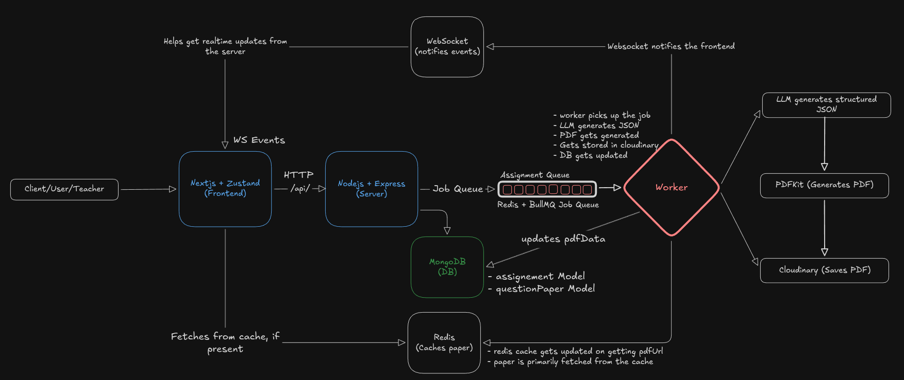

# VedaAI – AI Assessment Creator

An intelligent assessment creation platform that allows teachers to generate structured question papers using AI, with real-time progress updates and PDF export.

---

## Live Demo

- **Frontend**: https://veda-assignment.vercel.app
- **Backend**: https://veda-assignment-production-dc67.up.railway.app

---

## Architecture



### High Level Flow

```
Teacher fills form
        ↓
Next.js Frontend
        ↓
POST /api/assignments (Express)
        ↓
Assignment saved to MongoDB
        ↓
Job added to BullMQ Queue
        ↓
WebSocket connection opened (frontend listens)
        ↓
BullMQ Worker picks up job
        ↓
Groq LLM generates structured JSON
        ↓
JSON parsed + validated
        ↓
PDF generated via PDFKit
        ↓
PDF uploaded to Cloudinary
        ↓
QuestionPaper saved to MongoDB (with pdfUrl)
        ↓
Redis cache updated
        ↓
WebSocket notifies frontend (completed + pdfUrl)
        ↓
Frontend renders PDF in iframe
```

---

### System Components

```
┌─────────────────────────────────────────────────────┐
│                    Frontend (Vercel)                │
│                                                     │
│  Next.js 14 + TypeScript                            │
│  Zustand (form state)                               │
│  Axios (HTTP)                                       │
│  WebSocket (real-time updates)                      │
│  Tailwind CSS                                       │
└────────────────────┬────────────────────────────────┘
│ HTTP / WSS
┌────────────────────▼────────────────────────────────┐
│                   Backend (Railway)                 │
│                                                     │
│  Node.js + Express + TypeScript                     │
│                                                     │
│  ┌─────────────┐  ┌──────────────┐  ┌────────────┐  │
│  │   REST API  │  │  WebSocket   │  │  BullMQ    │  │
│  │  /api/      │  │  Server      │  │  Worker    │  │
│  └──────┬──────┘  └──────┬───────┘  └─────┬──────┘  │
│         │                │                │         │
│  ┌──────▼────────────────▼────────────────▼──────┐  │
│  │                  Redis (Railway)              │  │
│  │  - BullMQ job queue                           │  │
│  │  - Paper cache (24hr TTL)                     │  │
│  └───────────────────────────────────────────────┘  │
│                                                     │
│  ┌───────────────────┐   ┌───────────────────────┐  │
│  │  MongoDB Atlas    │   │  Cloudinary           │  │
│  │  - Assignments    │   │  - PDF storage        │  │
│  │  - QuestionPapers │   │  - Permanent URLs     │  │
│  └───────────────────┘   └───────────────────────┘  │
└─────────────────────────────────────────────────────┘
│
┌────────────────────▼────────────────────────────────┐
│                  External Services                  │
│                                                     │
│  Groq API (openai/gpt-oss-120b)                     │
│  - Structured JSON generation                       │
│  - Question paper creation                          │
└─────────────────────────────────────────────────────┘
```

---

## Tech Stack

| Layer            | Technology                           |
| ---------------- | ------------------------------------ |
| Frontend         | Next.js 14, TypeScript, Tailwind CSS |
| State Management | Zustand                              |
| Backend          | Node.js, Express, TypeScript         |
| Database         | MongoDB Atlas + Mongoose             |
| Cache / Queue    | Redis + BullMQ                       |
| Real-time        | WebSocket (ws)                       |
| AI               | Groq API (openai/gpt-oss-120b)       |
| PDF Generation   | PDFKit (server-side)                 |
| File Storage     | Cloudinary                           |
| Frontend Deploy  | Vercel                               |
| Backend Deploy   | Railway                              |

---

## Approach

### 1. Assignment Creation

Teacher fills a two-step form:

- **Step 1**: Upload material, set due date, configure question types (type, count, marks)
- **Step 2**: Set title, subject, grade level
- Form state managed globally via Zustand, persisted across steps

### 2. AI Generation Pipeline

Instead of directly calling the LLM from the API handler, the request is offloaded to a background job:

- API handler creates the assignment in MongoDB and immediately returns `assignmentId`
- A BullMQ job is queued with the assignment data
- The worker processes the job asynchronously:
  - Builds a structured prompt from assignment config
  - Calls Groq API (openai/gpt-oss-120b)
  - Parses and validates the raw JSON response
  - Maps it to typed `Section` and `Question` objects
  - Never exposes raw LLM output to the frontend

### 3. PDF Generation

PDF is generated server-side using PDFKit:

- Structured layout matching real exam paper format
- School header, student info section, sections with questions
- Difficulty tags, marks per question
- Answer key section
- Uploaded to Cloudinary, permanent URL stored in MongoDB

### 4. Real-time Updates

WebSocket connection is opened immediately after assignment creation:

- Frontend connects with `?assignmentId=xxx`
- Worker notifies via `wsManager.notify()` at each stage:
  - `status: active` → show spinner
  - `status: completed` → show PDF
  - `status: failed` → show error
- Fallback polling every 4 seconds in case WS misses the event

### 5. Caching Strategy

- Redis caches the generated paper for 24 hours
- Cache is invalidated by the worker after PDF is generated
- Only complete documents (with `pdfUrl`) are cached
- BullMQ uses Redis for job queue management

---

## Project Structure

```
vedaai/
├── backend/
│   ├── src/
│   │   ├── config/          # DB, Redis, Cloudinary, env
│   │   ├── controllers/     # Request handlers
│   │   ├── models/          # MongoDB schemas
│   │   ├── queues/          # BullMQ queue + worker
│   │   ├── routes/          # Express routes
│   │   ├── services/        # AI generation + PDF
│   │   ├── types/           # Shared TypeScript types
│   │   ├── utils/           # Response helpers
│   │   ├── ws/              # WebSocket manager
│   │   └── index.ts         # Entry point
│   ├── railway.json
│   └── package.json
│
├── frontend/
│   ├── src/
│   │   ├── app/             # Next.js app router pages
│   │   ├── components/      # Reusable UI components
│   │   ├── hooks/           # useWebSocket
│   │   ├── services/        # Axios API calls
│   │   ├── store/           # Zustand store
│   │   └── types/           # TypeScript types
│   ├── vercel.json
│   └── package.json
│
└── README.md
```

---

## Setup Instructions

### Prerequisites

- Node.js 18+
- MongoDB Atlas account or locally active mongodb setup
- Redis
- Groq API key
- Cloudinary account

### Backend

```bash
cd backend
npm install
```

Create `.env`:

```env
PORT=3001
MONGO_URI=mongodb+srv://...
REDIS_URL=redis://localhost:6379
GROQ_API_KEY=your_key
CLOUDINARY_CLOUD_NAME=your_cloud_name
CLOUDINARY_API_KEY=your_key
CLOUDINARY_API_SECRET=your_secret
NODE_ENV=development
```

Run the backend application:

```bash
npm run dev
```

### Frontend

```bash
cd frontend
npm install
```

Create `.env.local` OR `.env`:

```env
NEXT_PUBLIC_API_URL=http://localhost:3001
NEXT_PUBLIC_WS_URL=ws://localhost:3001
```

Run the frontend application:

```bash
npm run dev
```

Frontend runs on `http://localhost:3000`  
Backend runs on `http://localhost:3001`

---

## Environment Variables

### Backend

| Variable                | Description                     |
| ----------------------- | ------------------------------- |
| `PORT`                  | Server port                     |
| `MONGO_URI`             | MongoDB Atlas connection string |
| `REDIS_URL`             | Redis connection URL            |
| `GROQ_API_KEY`          | Groq API key                    |
| `CLOUDINARY_CLOUD_NAME` | Cloudinary cloud name           |
| `CLOUDINARY_API_KEY`    | Cloudinary API key              |
| `CLOUDINARY_API_SECRET` | Cloudinary API secret           |
| `NODE_ENV`              | `development` or `production`   |

### Frontend

| Variable              | Description           |
| --------------------- | --------------------- |
| `NEXT_PUBLIC_API_URL` | Backend API URL       |
| `NEXT_PUBLIC_WS_URL`  | Backend WebSocket URL |

---

## API Reference

| Method | Endpoint                      | Description                   |
| ------ | ----------------------------- | ----------------------------- |
| POST   | `/api/assignments`            | Create assignment + queue job |
| GET    | `/api/assignments`            | Get all assignments           |
| GET    | `/api/assignments/:id/status` | Get job status                |
| GET    | `/api/assignments/:id/paper`  | Get generated paper           |
| DELETE | `/api/assignments/:id`        | Delete assignment             |

### WebSocket

Connect: `ws://localhost:3001?assignmentId=xxx`

Events received:

```json
{ "event": "status", "status": "active", "message": "Generating..." }
{ "event": "completed", "status": "completed", "paper": {}, "pdfUrl": "https://..." }
{ "event": "failed", "status": "failed", "message": "Error message" }
```

---
